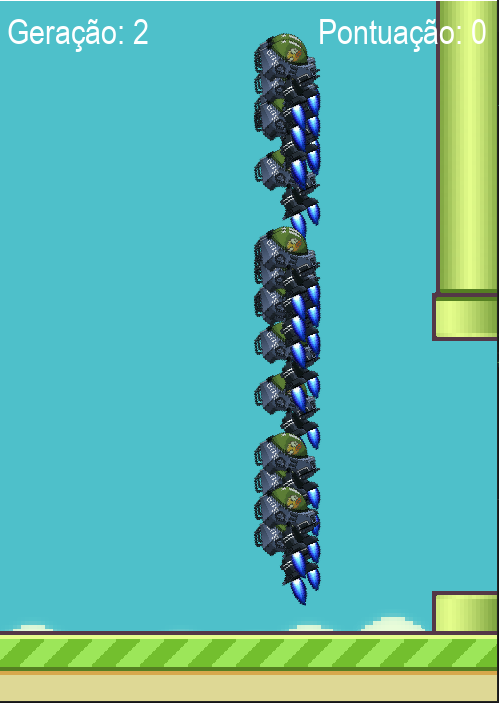

# Smart Bird

## An artificial intelligence playing Flappy Bird.
---

## Description
The Artificial Intelligence was made using NEAT - Neural Evolution Augmenting Topology (a neural network that progress each generation). For more informations, read: [NEAT-Python’s documentation](https://neat-python.readthedocs.io/en/latest/).

To understand the config.txt file, access: [Configuration file description](https://neat-python.readthedocs.io/en/latest/config_file.html).

The code was made in Python, using the "paygame", "on", "random" and "neat" libraries.

---
## How to run this project

To run this project, we have two options:

1) AI Plays
    * Download de SmartBirdAI.py file and the folders "images" and "config".
    * Install neat: `pip install neat-python`  - version used: 0.92
    * Install pygame: `pip install pygame` - version used: 2.3.0 
    * Run the SmartBirdAI.py file (Visual Stuio Code recommended).
2) You play
    * The same, but using the SmartBird.py file
___
## AI playing

Here we have an image of the AI playing the game. We have the 2º generation of Smart Birds trying to progress in the game. We also can see the score of the generation.

---
At the end of game, it shows the best generation and its score.

---
## Presentation Video

___
## Credits

This project has this tutorial as base:

[playlist - Inteligência Artificial no Pyhton](https://www.youtube.com/playlist?list=PLpdAy0tYrnKyVQDckS5IDB24QrSap2u8y)
___
## Upgrades

* I added a final score screen with the informations of the best generation.
* I changed the bird image used when AI is playing.
___
## What I learned

* The fundamentals of the Neural Network. 
* How to use NEAT and Pygame libraries. 
* How to recreat the Angry Bird game.
___

